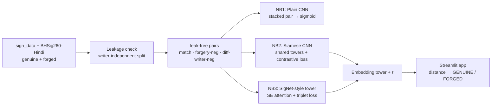

<div align="center">

# ✍️ Signature Forgery Verification

### Deep metric learning for offline handwritten-signature verification


<br>


<!-- Fill these in after running the notebooks on Colab -->


</div>

---

## 📌 Overview

This project verifies whether a questioned signature is **genuine** or a **forgery** by comparing
it against a known reference — the *offline signature verification* problem. Rather than training
one classifier per person, it learns a **distance metric** over signatures, so it can judge
**writers it has never seen during training** and enrol a new person from a single reference.

It is structured as a **three-notebook learning progression** that deliberately starts with the
naïve approach and evolves into the correct one, making the *why* behind each design choice
explicit. The best model is served through a small **Streamlit** app for live verification.

> Built end-to-end with concepts from the **CampusX “100 Days of Deep Learning”** syllabus — CNNs,
> the Keras Functional API, BatchNorm/Dropout/He-init, Adam + EarlyStopping, and transfer learning.

---

## 🧠 The core idea — why Siamese, not classification

A signature verifier is asked *“do these two signatures belong to the same hand?”* — a
**similarity** question, not a *“which of N people is this?”* classification question. Training a
per-person classifier breaks the moment a new person appears (you'd have to retrain).

A **Siamese network** solves the right problem: two identical, weight-sharing CNN towers map each
signature into an **embedding vector**, and a **contrastive loss** shapes that embedding space so
that genuine pairs sit close together and forgeries are pushed apart. Verification is then just a
**distance threshold** — and it generalises to unseen writers.

---

## 🗂️ The three-notebook progression

| # | Notebook | Paradigm | What it teaches | Generalises to unseen writers? |
|---|----------|----------|------------------|:---:|
| 1 | [`01_plain_cnn.ipynb`](notebooks/01_plain_cnn.ipynb) | Stack the pair → single CNN → sigmoid | Honest baseline; *feels* the limitation of treating verification as plain classification | ⚠️ Weakly |
| 1b | [`01b_data_leak_investigation.ipynb`](notebooks/01b_data_leak_investigation.ipynb) | sklearn probes, no training | The detective story: *why* NB1's 0.999 was a leak, proven with img1-only / img2-only probes | — |
| 2 | [`02_siamese_cnn.ipynb`](notebooks/02_siamese_cnn.ipynb) | Twin shared-weight CNN towers + **contrastive loss** | The correct paradigm: embeddings, distance, EER threshold | ✅ Yes |
| 3 | [`03_siamese_transfer.ipynb`](notebooks/03_siamese_transfer.ipynb) | **SigNet-style** purpose-built tower + **Squeeze-Excitation attention** + **triplet loss**, trained on Latin + Devanagari | A purpose-built signature tower (transfer learning *underperformed* here); cross-script evaluation | ✅ Yes |

> Run order: `01 → 01b → 02 → 03`. Notebook 3 was originally a frozen-MobileNetV2 transfer model,
> but that underperformed the from-scratch NB2 (ImageNet features don't fit thin pen strokes), so it
> was rebuilt into a purpose-built **SigNet-style** tower. The filename is kept for git continuity.
> The full reasoning is in [`research.md`](research.md).

---

## 📊 Results (writer-independent test set)

> The notebooks run on **Google Colab GPU**. After executing them, the saved
> `models/*_meta.json` files report these metrics — fill the table in from there.

| Model | Test ROC-AUC | Test EER | FAR | FRR |
|-------|:------------:|:--------:|:---:|:---:|
| Plain CNN (baseline, leaky) | _pending_ | _pending_ | _pending_ | _pending_ |
| Siamese CNN (contrastive) | _pending_ | _pending_ | _pending_ | _pending_ |
| **Siamese + SE attention + triplet** | **_pending_** | **_pending_** | _pending_ | _pending_ |

*Metrics: **ROC-AUC** (threshold-free separability), **EER** (Equal Error Rate — where false
accepts = false rejects), **FAR** (forgeries wrongly accepted), **FRR** (genuine wrongly rejected).
Notebook 3 also reports its test set broken out **overall / Latin / Devanagari**, plus an
independent **NFI cross-dataset** number.*

---

## ⚠️ Data integrity — a leakage bug we caught and fixed

The public dataset ships `train/` and `test/` folders, but **`test/` is a byte-identical duplicate
subset of `train/`** (verified with md5 — every file of writers `049–069` in `test/` matches the
same file in `train/`), and `test_data.csv` is a strict subset of `train_data.csv`. Using the
shipped split would mean **testing on training data** — inflated, meaningless numbers.

**Fix:** the dataset is re-partitioned by **writer ID** so train and test share no person:

| Split | Writers | Purpose |
|-------|---------|---------|
| Train | `001–040` | learn the embedding |
| Validation | `041–048` | pick the EER threshold |
| **Test** | **`049–069`** | **held-out, unseen writers** |

This **writer-independent** protocol is the standard for biometric verification and the single most
important reason the reported metrics are trustworthy.

### The second, subtler leak — the pairing leak

Even after the writer-independent split, the baseline (NB1) still scored a suspiciously perfect
**ROC-AUC 0.999** on unseen writers. Something felt off. Digging in revealed a second leak: in the
shipped CSVs the **label is a deterministic function of which folder the *second* image comes
from** — `label=0` (match) → `img2` is always genuine, `label=1` (forgery) → `img2` is always from a
`_forg` folder. So "do these match?" silently collapses into "is `img2` forged?", and the model can
ignore the reference signature entirely.

> An sklearn probe confirmed it: a model shown **only the questioned signature** (never the
> reference) still scores **0.913 AUC** on unseen writers, while a reference-only probe sits at
> chance (0.49). The signal was leaking through the pairing, not the comparison.

I had a hunch the 0.999 was too good to be real; working through it with **Claude** solidified that
intuition into a measured diagnosis, and together we wrote **[`check_data_leak.py`](check_data_leak.py)** —
a small script that flags *both* leaks (duplicate test set via md5, and the pairing leak via a
label-vs-`img2`-folder cross-tab) on any ICDAR-style dataset and exits non-zero if either is found:

```bash
python3 check_data_leak.py sign_data
```

**The fix:** build pairs from the raw per-writer folders with a third recipe — *genuine of A vs.
genuine of a different writer B*, labelled as a non-match. Now a genuine `img2` no longer gives away
the label, so the model is forced to actually compare the two signatures. NB2 and NB3 use this; NB1
is kept as the deliberately-flawed baseline. The full story is in
[`notebooks/01b_data_leak_investigation.ipynb`](notebooks/01b_data_leak_investigation.ipynb).

---

## 🏗️ Pipeline



---

## 📁 Repository anatomy

```
Signature-forgery-verification/
├── notebooks/
│   ├── 01_plain_cnn.ipynb              # baseline: stacked-pair CNN classifier (leaky 0.999)
│   ├── 01b_data_leak_investigation.ipynb  # why the 0.999 was a leak — sklearn probes
│   ├── 02_siamese_cnn.ipynb            # Siamese CNN + contrastive loss (leak-free pairs)
│   └── 03_siamese_transfer.ipynb       # SigNet-style tower + SE attention + triplet loss
├── streamlit/
│   └── app.py                      # upload 2 signatures → verdict + confidence
├── check_data_leak.py              # flags both leaks on an ICDAR-style dataset (exits non-zero)
├── build_combined_dataset.py       # builds sign_data_combined/ from sign_data + BHSig260-Hindi
├── models/                         # saved embedding towers (.keras) + meta JSON (threshold)
├── sign_data/                      # ICDAR 2011 signatures (Latin) — NB1/01b/NB2
├── sign_data_combined/             # ICDAR (Latin) + BHSig260-Hindi (Devanagari), merged — NB3
├── sign_data_nfi/                  # clean NFI subset — independent cross-dataset TEST set
├── requirements.txt
├── research.md                     # full research log (leaks, lit review, dataset, NB3 design)
└── README.md
```

---

## 🚀 Quickstart

### Train (Google Colab GPU — recommended)
1. Open a notebook in Colab → **Runtime ▸ Change runtime type ▸ GPU**.
2. **Run all.** The first cells `!git clone` this repo (the datasets ship inside it), so there's
   no path to edit. Each notebook saves its model + metadata into `models/`.

Run them in order — `01 → 01b → 02 → 03`. (`01b` is the sklearn-only leak investigation; it needs
no GPU.)

### Run the demo app (local)
```bash
pip install -r requirements.txt
streamlit run streamlit/app.py
```
Upload a reference and a questioned signature; the app embeds both, computes the distance, and
returns **GENUINE / FORGED** against the EER threshold. It auto-loads the best available saved
tower.

> **Note:** after the NB3 rebuild, the app needs a small update to use the new model's 1-channel
> *invert + divide-by-std* preprocessing — pending the Colab training run.

---

## 🔬 Technical deep-dive

<details>
<summary><b>1 · Architecture — why a Siamese network beats per-class classification</b></summary>

Verification is a same/different question. A classifier with one output per writer can't score a
writer it never trained on; a Siamese network learns a **general distance function** in embedding
space, so a new signer is enrolled with a single reference — no retraining. The two towers
**share weights** (built once with the **Keras Functional API** and called twice), guaranteeing
both signatures are mapped by the *same* function.
</details>

<details>
<summary><b>2 · Loss & threshold selection (contrastive → triplet)</b></summary>

**NB2 — contrastive loss.** With label `Y` (`0` = genuine pair, `1` = forgery) and Euclidean
distance `D` between L2-normalised embeddings:

```
L = (1 − Y) · ½ · D²   +   Y · ½ · max(0, margin − D)²
```

Genuine pairs minimise `D²`; forgeries are pushed to at least `margin`.

**NB3 — triplet loss.** A step up in metric learning: each training example is a triplet
(anchor, positive, negative) and the loss is `max(0, d(a,p)² − d(a,n)² + margin)`. The negative is
*either* a forgery of the anchor's writer *or* a genuine signature of a different writer — so both
hard and random negatives shape the space in one objective.

In both cases the decision threshold `τ` is chosen on the **validation** set at the **Equal Error
Rate**, then applied unchanged to the unseen-writer test set.
</details>

<details>
<summary><b>3 · Training recipe (from the 100-Days syllabus)</b></summary>

- **He / Glorot initialization** with ReLU (correct init/activation pairing for deep ReLU nets).
- **BatchNorm / LRN** for stable convergence; **Dropout** (0.3–0.5) against overfitting.
- **Adam** (NB1/NB2) or **RMSprop** (NB3, following SigNet); **EarlyStopping** (restore best
  weights) + **ReduceLROnPlateau**.
- **Input scaling:** `[0,1]` for NB1/NB2; NB3 follows SigNet — grayscale, **invert** (background→0),
  then **divide by the pixel std**.
- **Augmentation (NB3, signature-appropriate):** small rotation (±5°), shift (≤6%), zoom (±10%).
  Deliberately **no flips or large rotations** — a mirrored or upside-down signature isn't a
  plausible signature.
</details>

<details>
<summary><b>4 · Why notebook 3 dropped transfer learning</b></summary>

NB3 originally used a frozen **MobileNetV2** (ImageNet) tower. In practice it *underperformed* the
from-scratch NB2 — ImageNet features are tuned for natural-image textures, not thin pen strokes on
white, and freezing the whole backbone left only a small head to adapt. So NB3 was rebuilt as a
**purpose-built SigNet-style tower** (Conv 11/5/3/3 + LRN, Glorot init, FC 1024→128) with a
lightweight **Squeeze-and-Excitation** channel-attention block and triplet loss. The lesson — a
domain-appropriate architecture beats generic transfer here — is itself part of the project's story
(see [`research.md`](research.md)).
</details>

---

## 📚 Datasets

- **`sign_data/`** — ICDAR 2011 signatures (Latin): genuine signatures in folders named by writer
  ID (`068/`), forgeries in `<id>_forg/`. Primary training set for NB1/01b/NB2.
- **`sign_data_combined/`** — ICDAR (Latin) **+ BHSig260-Hindi (Devanagari)** merged into one
  collision-proof, grayscale-PNG dataset with a `manifest.csv` (224 writers). Notebook 3 trains on
  this and reports per-script generalisation. Built reproducibly by
  [`build_combined_dataset.py`](build_combined_dataset.py); see
  [`sign_data_combined/README.md`](sign_data_combined/README.md).
- **`sign_data_nfi/`** — a clean, deduplicated NFI subset committed as an independent
  **cross-dataset test set** (NB2/NB3 evaluate on it untouched, to measure honest domain transfer).

---

## ⚖️ Disclaimer

An **educational** project demonstrating deep metric learning — not a production authentication
system. Real-world signature verification requires far larger, audited datasets and must never
rely on a single model score.
