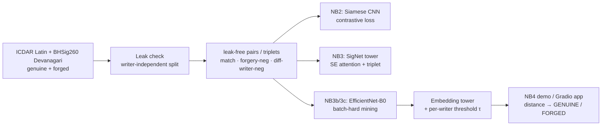

<div align="center">

# ✍️ Signature Forgery Verification

### Deep metric learning for offline handwritten-signature verification


<br>


[](https://huggingface.co/spaces/goyashek/signature-forgery-verification)


</div>

---

## 📌 Overview

This project verifies whether a questioned signature is **genuine** or a **forgery** by comparing
it against a known reference — the *offline signature verification* problem. Rather than training
one classifier per person, it learns a **distance metric** over signatures, so it can judge
**writers it has never seen during training** and enrol a new person from a single reference.

It is structured as a **learning progression** that deliberately starts with the naïve approach,
*feels* its limitation, and evolves into the correct one — making the *why* behind each design
choice explicit. The best model is shipped ready-to-run in
[`notebooks/04_final_demo.ipynb`](notebooks/04_final_demo.ipynb) and served through a small
**Gradio app on HuggingFace Spaces**.

> **The flagship finding isn't a model — it's a data leak.** A naïve baseline scored a
> near-perfect **ROC-AUC 0.999**. That number was a lie: the public dataset has a leak baked into
> the **CSV pair files that essentially every public Siamese + CNN notebook on it reads from**
> (100+ on Kaggle). This project is built around catching that leak, proving it with controlled
> probes, fixing it, and shipping a script that detects it automatically. Once we measured
> honestly, our "modest" numbers turned out to be the *only trustworthy* ones — and matched the
> peer-reviewed literature.

> Built end-to-end with concepts from the **CampusX "100 Days of Deep Learning"** syllabus — CNNs,
> the Keras Functional API, BatchNorm/Dropout/He-init, Adam/RMSprop + EarlyStopping, transfer
> learning, and metric learning (contrastive → triplet → batch-hard).

---

## 🧠 The core idea — why Siamese, not classification

A signature verifier is asked *"do these two signatures belong to the same hand?"* — a
**similarity** question, not a *"which of N people is this?"* classification question. Training a
per-person classifier breaks the moment a new person appears (you'd have to retrain).

A **Siamese network** solves the right problem: two identical, weight-sharing CNN towers map each
signature into an **embedding vector**, and a metric-learning loss shapes that space so genuine
pairs sit close together and forgeries are pushed apart. Verification is then just a **distance
threshold** — and it generalises to unseen writers, enrolling a new signer from a single reference.

---

## 🏆 Results (writer-independent, leak-free test set)

Every number below is on **writers never seen in training**, with **leak-free pairs** — so they
are trustworthy. The story is the *progression*: a fake 0.999, an honest 0.973, then a genuine
climb to **0.986** by improving the architecture and the training signal.

| # | Model | Test ROC-AUC | Test EER | FAR | FRR | Cross-dataset (NFI) AUC |
|---|-------|:------------:|:--------:|:---:|:---:|:---:|
| 1 | Plain CNN (stacked pair) | `0.999` ⚠️ *leak — not real* | — | — | — | — |
| 2 | Siamese CNN + contrastive | 0.973 | 6.1% | 9.7% | 6.6% | 0.791 |
| 3 | SigNet-style tower + triplet | 0.915 | 18.8% | 12.1% | 23.5% | 0.852 |
| 3b | Fine-tuned EfficientNet-B0 + triplet | 0.941 | 12.5% | 9.9% | 17.5% | 0.871 |
| **3c** | **EfficientNet-B0 + batch-hard mining** | **0.986** | **8.0%** | **6.5%** | **5.8%** | **0.877** |

**The shipped model (3c)** — best on every axis, in a **17 MB** model (4.2 M params):

| view | ROC-AUC | accuracy | FAR | FRR |
|---|:---:|:---:|:---:|:---:|
| overall (global threshold) | 0.986 | 93.9% | 6.5% | 5.8% |
| Latin only | 0.989 | 94.9% | 8.6% | 1.7% |
| Devanagari only | 0.984 | 92.9% | 6.5% | 7.7% |
| **best operating point** *(per-writer threshold)* | **0.989** | — | **3.5%** | **7.7%** |

*Metrics: **ROC-AUC** (threshold-free separability), **EER** (Equal Error Rate — where false
accepts = false rejects), **FAR** (forgeries wrongly accepted — the costly error), **FRR**
(genuine wrongly rejected).*

> **Honest caveat.** On a fully independent dataset (NFI — different pens, scanners, forgery
> styles), AUC holds up reasonably (0.877) but the *threshold tuned on training data* lets too many
> forgeries through (FAR ≈ 42% at the global threshold). The model's **ranking** is sound; what
> needs recalibrating per-dataset is the **threshold**. This is expected and well-documented in the
> signature literature — a single model score should never be the only check in a real system.

---

## 🗂️ The notebook progression

| # | Notebook | Paradigm | What it teaches |
|---|----------|----------|------------------|
| 1 | [`01_plain_cnn.ipynb`](notebooks/01_plain_cnn.ipynb) | Stack the pair → single CNN → sigmoid | Honest baseline; *feels* why verification ≠ plain classification. Scores a fake 0.999. |
| 1b | [`01b_data_leak_investigation.ipynb`](notebooks/01b_data_leak_investigation.ipynb) | sklearn probes, no training | **The detective story:** *why* the 0.999 was a leak, proven with img1-only / img2-only probes. |
| 2 | [`02_siamese_cnn.ipynb`](notebooks/02_siamese_cnn.ipynb) | Twin shared-weight towers + **contrastive loss** | The correct paradigm: embeddings, distance, EER threshold. Earns an honest 0.973. |
| 3 | [`03_siamese_transfer.ipynb`](notebooks/03_siamese_transfer.ipynb) | **SigNet-style** tower + **SE attention** + **triplet loss**, Latin + Devanagari | A purpose-built signature tower; cross-script evaluation. |
| 3b | [`03b_siamese_efficientnet.ipynb`](notebooks/03b_siamese_efficientnet.ipynb) | **Fine-tuned EfficientNet-B0** + triplet | Transfer learning done *right* — fine-tuned, not frozen. |
| 3c | [`03c_siamese_batchhard.ipynb`](notebooks/03c_siamese_batchhard.ipynb) | **+ online batch-hard mining** + adaptive per-writer thresholds | **The winner.** Mines the hardest skilled forgeries each batch; calibrates per writer. |
| 4 | [`04_final_demo.ipynb`](notebooks/04_final_demo.ipynb) | Load best model → verify real pairs | **Practical showcase** — loads 3c and demonstrates verdicts. No training. |

> Run order: `01 → 01b → 02 → 03 → 03b → 03c → 04`. Notebooks 1–3 are independent learning steps;
> 3b/3c build the production model; 4 just loads and demonstrates it. Each notebook documents the
> reasoning behind its design choices inline.

---

## ⚠️ The flagship — a systemic data leak, caught and fixed

The ICDAR dataset is one of the most-used signature benchmarks on Kaggle, and it ships two leaks.
The second is subtle enough that **virtually every public Siamese + CNN notebook built on it
inherits the same inflated scores** — because they all read the same pre-made pair CSVs.

### Leak #1 — the duplicate test set

The dataset has `train/` and `test/` folders, but **`test/` is a byte-identical duplicate subset
of `train/`** (verified with md5 — every file of writers `049–069` in `test/` matches the same
file in `train/`). Using the shipped split means **testing on training data**.

**Fix — re-partition by writer ID** so no person appears in two splits:

| Split | Writers | Purpose |
|-------|---------|---------|
| Train | `001–040` | learn the embedding |
| Validation | `041–048` | pick the EER threshold |
| **Test** | **`049–069`** | **held-out, unseen writers** |

This **writer-independent** protocol is the standard for biometric verification and the single
biggest reason the metrics are trustworthy.

### Leak #2 — the pairing leak (the subtle, systemic one)

Even after the writer-independent split, the baseline still scored a suspiciously perfect
**ROC-AUC 0.999** on unseen writers. The cause: in the shipped CSVs, the **label is a
deterministic function of which folder the *second* image comes from** — across all 23,206 pairs,
zero exceptions:

| label | meaning | `img2` source |
|---|---|---|
| 0 | match | **always** a genuine folder |
| 1 | forgery | **always** a `_forg` folder |

So "do these two signatures match?" silently collapses into "is `img2` forged?" — a single-image
artifact detector that **ignores the reference signature entirely**. Because forgery artifacts are
generic across writers, the shortcut *generalises to unseen writers*, which is exactly why the
writer-independent split alone did **not** catch it.

**Proof — controlled sklearn probes** (writer-independent; the `img2` probe never sees the reference):

| probe (unseen writers 049–069) | ROC-AUC |
|---|---|
| `img1` only (reference signature) | **0.493** — chance, as expected |
| `img2` only (questioned signature) | **0.913** |
| Plain CNN on both stacked | 0.999 |

A model that **never sees the reference** still hits 0.913. That is the leak, measured.

**Fix — a third pair recipe.** Build pairs from the raw per-writer folders (not the leaky CSV),
adding *genuine-of-A vs genuine-of-a-different-writer-B* as a non-match:

| pair type | img1 | img2 | label |
|---|---|---|---|
| match | genuine of A | genuine of A | 0 |
| hard negative | genuine of A | forgery of A | 1 |
| **random negative (new)** | genuine of A | genuine of **B** | 1 |

Now a genuine `img2` no longer implies "match", so the model is *forced* to compare the two
signatures. NB2 onward use this; NB1 is kept as the deliberately-flawed baseline.

### The automated detector — [`check_data_leak.py`](check_data_leak.py)

The manual investigation was turned into a reusable script that flags **both** leaks on any
ICDAR-style dataset and exits non-zero if either is found (so it can gate a pipeline):

```bash
python3 check_data_leak.py sign_data
# LEAK 1: md5-hashes train/ vs test/        → 100% duplication
# LEAK 2: cross-tabs label vs img2 folder   → 100% label-from-folder
```

The full story, executed with real outputs, is in
[`notebooks/01b_data_leak_investigation.ipynb`](notebooks/01b_data_leak_investigation.ipynb).

---

## 🏗️ Pipeline



---

## 🔬 Technical deep-dive

<details>
<summary><b>1 · Why a Siamese network beats per-class classification</b></summary>

Verification is a same/different question. A classifier with one output per writer can't score a
writer it never trained on; a Siamese network learns a **general distance function** in embedding
space, so a new signer is enrolled with a single reference — no retraining. The towers **share
weights** (built once with the Keras Functional API, called twice), guaranteeing both signatures
are mapped by the *same* function.
</details>

<details>
<summary><b>2 · The loss evolution — contrastive → triplet → batch-hard</b></summary>

**NB2 — contrastive loss.** With label `Y` (`0`=genuine, `1`=forgery) and Euclidean distance `D`
between L2-normalised embeddings: `L = (1−Y)·½·D² + Y·½·max(0, margin−D)²`. Genuine pairs minimise
`D²`; forgeries are pushed to at least `margin`.

**NB3 / 3b — triplet loss.** Each example is a triplet (anchor, positive, negative):
`max(0, d(a,p)² − d(a,n)² + margin)`, margin 0.3. The negative is *either* a forgery of the
anchor's writer *or* a genuine of a different writer.

**3c — online batch-hard mining.** The biggest training upgrade. Each batch samples *P* writers ×
*K* images (genuine **and** their forgeries); for every genuine anchor we mine the **hardest
positive** (farthest same-writer genuine) and **hardest negative** (closest non-matching image)
*inside the batch*. Because a writer's own forgeries are in the batch, the hardest negative is
usually a **skilled forgery** — so training focuses precisely where false-accepts come from. This
is what drove the FAR down and the AUC up to 0.986.

The decision threshold `τ` is chosen on the **validation** set at the **Equal Error Rate**, then
applied unchanged to the unseen-writer test set.
</details>

<details>
<summary><b>3 · Threshold calibration — global → per-script → per-writer</b></summary>

A single global threshold is a compromise. Two refinements (no retraining, just a better operating
point — AUC is unchanged):

- **Per-script threshold** — calibrate a separate EER threshold for Latin and Devanagari on the
  validation set, apply each to its own test pairs. Fixes the Latin over-rejection (FRR 35% → ~2%).
- **Per-writer adaptive threshold** — the real-world version. Enrol each writer from a few genuine
  references, set `τ_w = mean + α·std` of their reference distances (their natural spread), and tune
  the single knob `α` on validation. This is the **best operating point**: FAR 3.5% / FRR 7.7%.

Both calibrate on validation/enrolment only — never on test — so the numbers stay honest.
</details>

<details>
<summary><b>4 · Why NB3 dropped transfer learning — and why 3b brought it back</b></summary>

NB3 originally used a **frozen MobileNetV2** (ImageNet) tower. It *underperformed* the from-scratch
NB2 — ImageNet features fit natural textures, not thin pen strokes, and freezing the backbone left
only a tiny head to adapt. So NB3 was rebuilt as a purpose-built **SigNet-style** tower.

3b then re-tested the hypothesis **fairly**: a **fine-tuned** (not frozen) EfficientNet-B0, with
the signature-domain **invert** preprocessing kept. That flipped the result — fine-tuned transfer
*beats* the from-scratch tower (0.941 vs 0.915, and 0.871 vs 0.852 cross-dataset) at **~30× fewer
parameters** (the from-scratch tower's `Flatten→Dense(1024)` was ~111 M params / 521 MB;
EfficientNet's `GlobalAveragePooling→Dense(128)` is ~4 M). The refined lesson: *frozen* transfer
fails on pen strokes, but *fine-tuned* transfer + domain preprocessing wins.
</details>

<details>
<summary><b>5 · Training recipe (from the 100-Days syllabus)</b></summary>

- **He / Glorot init** with ReLU; **BatchNorm / LRN** for stable convergence; **Dropout** (0.3–0.5).
- **Adam** (NB1/NB2/3b/3c) or **RMSprop** (NB3, following SigNet); **EarlyStopping** + **ReduceLROnPlateau**.
- **Preprocessing:** SigNet-style **invert** (background→0, ink = signal). NB3 also divides by pixel
  std; 3b/3c feed the inverted image to EfficientNet (which normalises internally).
- **Augmentation (signature-appropriate):** small rotation (±5°), shift (≤6%), zoom (±10%).
  Deliberately **no flips or large rotations** — a mirrored or upside-down signature isn't plausible.
- **Colab free-tier safe:** 3b/3c checkpoint to Google Drive every epoch and resume after a disconnect.
</details>

---

## 🚀 Quickstart

### See the final model work (fastest)
Open [`notebooks/04_final_demo.ipynb`](notebooks/04_final_demo.ipynb) in Colab and **Run all**.
It clones the repo (the trained 17 MB model ships inside, in `models/`), loads it, and verifies
real genuine/forgery pairs across both scripts. No training, no setup.

### Reproduce the progression (Google Colab GPU)
1. Open a notebook → **Runtime ▸ Change runtime type ▸ GPU**.
2. **Run all.** The first cells `!git clone` this repo (datasets ship inside), so there's no path to edit.

Run in order: `01 → 01b → 02 → 03 → 03b → 03c → 04`. (`01b` is sklearn-only — no GPU needed.)

### Run the demo app (HuggingFace Spaces or local)
The app is a **Gradio** Space. Try it live on HuggingFace, or run it locally:
```bash
pip install -r requirements.txt
python app.py
```
Upload **one or more genuine reference** signatures and a **questioned** one; the app embeds
each, computes the distance, and returns **GENUINE / FORGED**. Give 3–5 references to unlock
the **per-writer adaptive threshold** (the best operating point, FAR ≈ 3.5%); a single
reference uses the global threshold.

---

## 📁 Repository anatomy

```
Signature-forgery-verification/
├── notebooks/
│   ├── 01_plain_cnn.ipynb                 # baseline: stacked-pair CNN (leaky 0.999)
│   ├── 01b_data_leak_investigation.ipynb  # why the 0.999 was a leak — sklearn probes
│   ├── 02_siamese_cnn.ipynb               # Siamese CNN + contrastive (leak-free pairs)
│   ├── 03_siamese_transfer.ipynb          # SigNet-style tower + SE attention + triplet
│   ├── 03b_siamese_efficientnet.ipynb     # fine-tuned EfficientNet-B0 + triplet
│   ├── 03c_siamese_batchhard.ipynb        # + batch-hard mining + per-writer thresholds (BEST)
│   └── 04_final_demo.ipynb                # loads the shipped model → live verdicts
├── models/
│   ├── siamese_bh_embedding.keras         # the shipped 3c tower (17 MB)
│   └── siamese_bh_meta.json               # threshold, preprocessing, per-writer α
├── app.py                                 # Gradio app (HF Spaces): upload refs + questioned → verdict
├── check_data_leak.py                     # flags both leaks (exits non-zero if found)
├── build_combined_dataset.py              # builds sign_data_combined/ reproducibly
├── sign_data/                             # ICDAR 2011 (Latin) — NB1/01b/NB2
├── sign_data_combined/                    # ICDAR + BHSig260-Hindi merged (224 writers) — NB3/3b/3c
├── sign_data_nfi/                         # clean NFI subset — independent cross-dataset TEST set
├── requirements.txt
└── README.md
```

---

## 📚 Datasets

- **`sign_data/`** — ICDAR 2011 signatures (Latin): genuine in folders named by writer ID,
  forgeries in `<id>_forg/`. Primary training set for NB1/01b/NB2.
- **`sign_data_combined/`** — ICDAR (Latin) **+ BHSig260-Hindi (Devanagari)** merged into one
  collision-proof, grayscale-PNG dataset with a `manifest.csv` (224 writers). NB3/3b/3c train on
  this and report **per-script** generalisation. Built reproducibly by
  [`build_combined_dataset.py`](build_combined_dataset.py).
- **`sign_data_nfi/`** — a clean, deduplicated NFI subset committed as an independent
  **cross-dataset test set** (evaluated untouched, to measure honest domain transfer).

---

## ⚖️ Disclaimer

An **educational** project demonstrating deep metric learning and rigorous evaluation — not a
production authentication system. Real-world signature verification requires far larger, audited
datasets and must never rely on a single model score.
