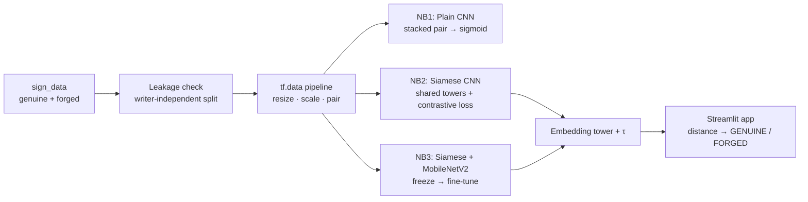

<div align="center">

# ✍️ Signature Forgery Verification

### Deep metric learning for offline handwritten-signature verification


<br>


<!-- Fill these in after running the notebooks on Colab -->


</div>

---

## 📌 Overview

This project verifies whether a questioned signature is **genuine** or a **forgery** by comparing
it against a known reference — the *offline signature verification* problem. Rather than training
one classifier per person, it learns a **distance metric** over signatures, so it can judge
**writers it has never seen during training** and enrol a new person from a single reference.

It is structured as a **three-notebook learning progression** that deliberately starts with the
naïve approach and evolves into the correct one, making the *why* behind each design choice
explicit. The best model is served through a small **Streamlit** app for live verification.

> Built end-to-end with concepts from the **CampusX “100 Days of Deep Learning”** syllabus — CNNs,
> the Keras Functional API, BatchNorm/Dropout/He-init, Adam + EarlyStopping, and transfer learning.

---

## 🧠 The core idea — why Siamese, not classification

A signature verifier is asked *“do these two signatures belong to the same hand?”* — a
**similarity** question, not a *“which of N people is this?”* classification question. Training a
per-person classifier breaks the moment a new person appears (you'd have to retrain).

A **Siamese network** solves the right problem: two identical, weight-sharing CNN towers map each
signature into an **embedding vector**, and a **contrastive loss** shapes that embedding space so
that genuine pairs sit close together and forgeries are pushed apart. Verification is then just a
**distance threshold** — and it generalises to unseen writers.

---

## 🗂️ The three-notebook progression

| # | Notebook | Paradigm | What it teaches | Generalises to unseen writers? |
|---|----------|----------|------------------|:---:|
| 1 | [`01_plain_cnn.ipynb`](notebooks/01_plain_cnn.ipynb) | Stack the pair → single CNN → sigmoid | Honest baseline; *feels* the limitation of treating verification as plain classification | ⚠️ Weakly |
| 2 | [`02_siamese_cnn.ipynb`](notebooks/02_siamese_cnn.ipynb) | Twin shared-weight CNN towers + **contrastive loss** | The correct paradigm: embeddings, distance, EER threshold | ✅ Yes |
| 3 | [`03_siamese_transfer.ipynb`](notebooks/03_siamese_transfer.ipynb) | Siamese towers on a **pretrained MobileNetV2** (freeze → fine-tune) | Transfer learning on top of metric learning; best accuracy, lightest to deploy | ✅ Yes |

---

## 📊 Results (writer-independent test set)

> The notebooks run on **Google Colab GPU**. After executing them, the saved
> `models/*_meta.json` files report these metrics — fill the table in from there.

| Model | Test ROC-AUC | Test EER | FAR | FRR |
|-------|:------------:|:--------:|:---:|:---:|
| Plain CNN (baseline) | _pending_ | _pending_ | _pending_ | _pending_ |
| Siamese CNN | _pending_ | _pending_ | _pending_ | _pending_ |
| **Siamese + MobileNetV2** | **_pending_** | **_pending_** | _pending_ | _pending_ |

*Metrics: **ROC-AUC** (threshold-free separability), **EER** (Equal Error Rate — where false
accepts = false rejects), **FAR** (forgeries wrongly accepted), **FRR** (genuine wrongly rejected).*

---

## ⚠️ Data integrity — a leakage bug we caught and fixed

The public dataset ships `train/` and `test/` folders, but **`test/` is a byte-identical duplicate
subset of `train/`** (verified with md5 — every file of writers `049–069` in `test/` matches the
same file in `train/`), and `test_data.csv` is a strict subset of `train_data.csv`. Using the
shipped split would mean **testing on training data** — inflated, meaningless numbers.

**Fix:** the dataset is re-partitioned by **writer ID** so train and test share no person:

| Split | Writers | Purpose |
|-------|---------|---------|
| Train | `001–040` | learn the embedding |
| Validation | `041–048` | pick the EER threshold |
| **Test** | **`049–069`** | **held-out, unseen writers** |

This **writer-independent** protocol is the standard for biometric verification and the single most
important reason the reported metrics are trustworthy.

---

## 🏗️ Pipeline



---

## 📁 Repository anatomy

```
Signature-forgery-verification/
├── notebooks/
│   ├── 01_plain_cnn.ipynb          # baseline: stacked-pair CNN classifier
│   ├── 02_siamese_cnn.ipynb        # Siamese CNN + contrastive loss (from scratch)
│   └── 03_siamese_transfer.ipynb   # Siamese + MobileNetV2 transfer learning
├── streamlit/
│   └── app.py                      # upload 2 signatures → verdict + confidence
├── models/                         # saved embedding towers (.keras) + meta JSON (threshold)
├── sign_data/                      # ICDAR 2011 Dutch signatures (genuine + *_forg)
├── sign_data2/                     # secondary CEDAR-style set (optional cross-check)
├── requirements.txt
└── README.md
```

---

## 🚀 Quickstart

### Train (Google Colab GPU — recommended)
1. Upload the repo (with `sign_data/`) to Google Drive.
2. Open a notebook in Colab → **Runtime ▸ Change runtime type ▸ GPU**.
3. Edit the `DATA_ROOT` path in the **config cell** to your Drive location.
4. **Run all.** Each notebook saves its model + metadata into `models/`.

Run them in order — `01 → 02 → 03`. The final cell of notebook 3 prints the comparison table.

### Run the demo app (local)
```bash
pip install -r requirements.txt
streamlit run streamlit/app.py
```
Upload a reference and a questioned signature; the app embeds both, computes the distance, and
returns **GENUINE / FORGED** against the EER threshold. It auto-loads the best available model
(transfer-learning tower preferred, from-scratch CNN as fallback).

---

## 🔬 Technical deep-dive

<details>
<summary><b>1 · Architecture — why a Siamese network beats per-class classification</b></summary>

Verification is a same/different question. A classifier with one output per writer can't score a
writer it never trained on; a Siamese network learns a **general distance function** in embedding
space, so a new signer is enrolled with a single reference — no retraining. The two towers
**share weights** (built once with the **Keras Functional API** and called twice), guaranteeing
both signatures are mapped by the *same* function.
</details>

<details>
<summary><b>2 · Contrastive loss & threshold selection</b></summary>

With label `Y` (`0` = genuine pair, `1` = forgery) and Euclidean distance `D` between L2-normalised
embeddings:

```
L = (1 − Y) · ½ · D²   +   Y · ½ · max(0, margin − D)²
```

Genuine pairs minimise `D²`; forgeries are pushed to at least `margin`. The decision threshold `τ`
is chosen on the **validation** set at the **Equal Error Rate**, then applied unchanged to the
unseen-writer test set.
</details>

<details>
<summary><b>3 · Training recipe (from the 100-Days syllabus)</b></summary>

- **He initialization** with ReLU (correct init/activation pairing for deep ReLU nets).
- **BatchNorm** for stable, faster convergence; **Dropout** (0.3–0.5) against overfitting.
- **Adam** optimizer; **EarlyStopping** (restore best weights) + **ReduceLROnPlateau**.
- **Input scaling** to `[0,1]` (from-scratch) or MobileNetV2 `preprocess_input` `[-1,1]` (transfer).
</details>

<details>
<summary><b>4 · Transfer learning — freeze then fine-tune</b></summary>

MobileNetV2 (ImageNet) is used as the tower. **Phase 1:** freeze the backbone, train only the
embedding head. **Phase 2:** unfreeze the top layers and continue at a **10× smaller learning
rate**. The backbone is called with `training=False` so its **BatchNorm statistics stay frozen** —
a crucial detail; otherwise small batches would corrupt the pretrained stats. Grayscale signatures
are replicated to 3 channels to match the backbone's expected input.
</details>

---

## 📚 Dataset

ICDAR 2011 Dutch signature dataset (`sign_data/`): genuine signatures live in folders named by
writer ID (`068/`), forgeries in `<id>_forg/`. A secondary CEDAR-style set (`sign_data2/`) is
included for optional cross-distribution checks.

---

## ⚖️ Disclaimer

An **educational** project demonstrating deep metric learning — not a production authentication
system. Real-world signature verification requires far larger, audited datasets and must never
rely on a single model score.
