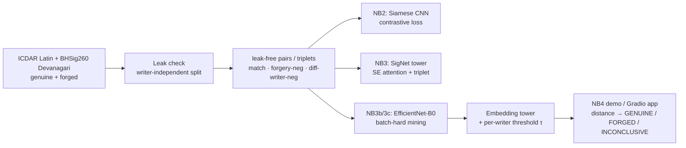

<div align="center">

# ✍️ Signature Forgery Verification

### Deep metric learning for offline handwritten-signature verification


[](https://huggingface.co/spaces/goyashek/signature-forgery-verification)


</div>

---

## At a glance

[🚀 Try the live demo](https://huggingface.co/spaces/goyashek/signature-forgery-verification)
· [📓 View notebook](notebooks/04_final_demo.ipynb)
· [▶ Run in Colab](https://colab.research.google.com/github/goyashek/Signature-forgery-verification/blob/main/notebooks/04_final_demo.ipynb)

https://github.com/user-attachments/assets/916cf1ca-7b2c-4ed0-9a19-3ff0e9ea259f

- **Task:** Verify whether a questioned offline signature matches an enrolled writer.
- **Best model:** EfficientNet-B0 + online batch-hard metric learning
- **Held-out benchmark:** ROC-AUC **0.986** on unseen writers
- **External benchmark:** ROC-AUC **0.877** on NFI
- **Main finding:** A suspicious 0.999 baseline exposed two dataset leaks, so I rebuilt the pairing and evaluation protocol.

## 📌 Overview

This project verifies whether a questioned offline signature matches an enrolled writer. Instead of
training one classifier per person, it learns a distance metric over signatures, allowing the model to
assess writers absent from training using a small reference set.

I built it as a learning progression: start with a naive baseline, investigate why it fails, and work
toward the final metric-learning model. The final model is demonstrated in
[`notebooks/04_final_demo.ipynb`](notebooks/04_final_demo.ipynb) and served through a Gradio app on
Hugging Face Spaces.

> A suspicious 0.999 ROC-AUC led to the project’s main investigation: the supplied data contained two
> leakage patterns that inflated the baseline. I verified both with controlled probes, rebuilt the split
> and pair-generation process, and added an automated detector. See the
> [data-leak investigation](#data-leaks).

---

## 🧠 The core idea — why Siamese, not classification

A signature verifier is really being asked *"do these two signatures belong to the same hand?"* —
that's a similarity question, not a *"which of N people is this?"* classification question. Training
a per-person classifier breaks the moment a new person shows up, since you'd have to retrain it.

A Siamese network solves the right problem: two identical, weight-sharing CNN towers map each
signature into an embedding vector, and a metric-learning loss shapes that space so genuine pairs sit
close together and forgeries get pushed apart. Verification is then just a distance threshold — and it
generalises to unseen writers without retraining the model for each signer.

---

## 🏆 Writer-independent held-out benchmark results

The same held-out writer split was used to compare project iterations, so these figures are
model-development benchmarks rather than a single untouched final evaluation.

**Evaluation protocol:** 145 training writers, 28 validation writers, and 51 held-out test writers.
Writers were split before pair generation; no writer appears in more than one split. Positive pairs use
genuine signatures from the same writer, while negatives include skilled forgeries and genuine
signatures from different writers. Thresholds are selected on validation writers.

### A. Pair-level model-development benchmark

This table compares embedding towers under that protocol. It is not directly comparable with the
app-level outcomes below.

| # | Model | Held-out ROC-AUC | Val EER | Held-out FAR | Held-out FRR | Cross-dataset (NFI) AUC |
|---|-------|:------------:|:--------:|:---:|:---:|:---:|
| 1 | Plain CNN (stacked pair) | `0.999` ⚠️ *leak — not real* | — | — | — | — |
| 2 | Siamese CNN + contrastive | 0.973 | 6.1% | 9.7% | 6.6% | 0.791 |
| 3 | SigNet-style tower + triplet | 0.915 | 18.8% | 12.1% | 23.5% | 0.852 |
| 3b | Fine-tuned EfficientNet-B0 + triplet | 0.941 | 12.5% | 9.9% | 17.5% | 0.871 |
| **3c** | **EfficientNet-B0 + batch-hard mining** | **0.986** | **8.0%** | **6.5%** | **5.8%** | **0.877** |

**Model-development views for 3c** — a **17 MB** model (4.2 M params):

| view | ROC-AUC | accuracy | FAR | FRR |
|---|:---:|:---:|:---:|:---:|
| overall (global threshold) | 0.986 | 93.9% | 6.5% | 5.8% |
| Latin only | 0.989 | 94.9% | 8.6% | 1.7% |
| Devanagari only | 0.984 | 92.9% | 6.5% | 7.7% |
| per-writer threshold *(older two-state development protocol)* | 0.989 | — | 3.5% | 7.7% |

### B. End-to-end enrolment and verification protocol

The shipped path uses five genuine references, `α=1.25`, and an abstention band. It answers a
different question from the pair-level benchmark: how often does the complete app return each of its
three decisions? These figures were produced by running
[`04_final_demo.ipynb`](notebooks/04_final_demo.ipynb) with the same `inference.py` path used by the
app:

| questioned sample | returned genuine | inconclusive | returned forged |
|---|---:|---:|---:|
| genuine (n=717) | 68.62% | 22.87% | 8.51% |
| forgery (n=1,148) | **0.17%** | 2.79% | 97.04% |

The end-to-end distance AUC is **0.9885** across 51 unseen test writers. The three columns matter
more for deployment: an inconclusive result is deliberately not counted as either an acceptance or a
rejection.

> Metrics are point estimates from one training run; variation across random seeds has not yet been
> measured.

<details>
<summary><b>Terminology</b></summary>

- **FAR:** Forgeries incorrectly accepted as genuine.
- **FRR:** Genuine signatures incorrectly rejected.
- **EER:** The operating point where FAR and FRR are equal.
- **Writer-independent:** Evaluation on writers absent from training.
- **Skilled forgery:** An imitation made after observing a genuine signature.
</details>

> **External NFI benchmark.** The model was not trained on NFI, but later preprocessing comparisons
> were informed by its results. Treat this as an external cross-dataset benchmark, not an untouched
> final evaluation. The learned ranking transfers partially (AUC 0.877), but the threshold tuned on
> the training data lets too many forgeries through (global-threshold FAR ≈ 42%). Thresholds must be
> recalibrated for each acquisition domain.
>
> The older per-writer two-state threshold is a strong operating point **in-domain**, but it does *not*
> transfer either: on NFI it drops to AUC 0.787 / FAR 32% / FRR 20%, since the writer's genuine
> spread is estimated from just a few references on an unfamiliar acquisition setup. Both operating
> points need per-dataset recalibration before use on a new source.

---

## 🗂️ The notebook progression

| # | Notebook | Paradigm | What it teaches |
|---|----------|----------|------------------|
| 1 | [`01_plain_cnn.ipynb`](notebooks/01_plain_cnn.ipynb) | Stack the pair → single CNN → sigmoid | Honest baseline; shows why verification ≠ plain classification. Scores a fake 0.999. |
| 1b | [`01b_data_leak_investigation.ipynb`](notebooks/01b_data_leak_investigation.ipynb) | sklearn probes, no training | Why the 0.999 was a leak, shown with img1-only / img2-only probes. |
| 2 | [`02_siamese_cnn.ipynb`](notebooks/02_siamese_cnn.ipynb) | Twin shared-weight towers + contrastive loss | Shared embeddings, distance, and an EER threshold. Test AUC: 0.973. |
| 3 | [`03_siamese_transfer.ipynb`](notebooks/03_siamese_transfer.ipynb) | SigNet-style tower + SE attention + triplet loss, Latin + Devanagari | A purpose-built signature tower; cross-script evaluation. |
| 3b | [`03b_siamese_efficientnet.ipynb`](notebooks/03b_siamese_efficientnet.ipynb) | Fine-tuned EfficientNet-B0 + triplet | Tests fine-tuning after the frozen backbone underperformed. |
| 3c | [`03c_siamese_batchhard.ipynb`](notebooks/03c_siamese_batchhard.ipynb) | + online batch-hard mining + adaptive per-writer thresholds | Highest held-out model-development AUC in the project; calibrates a threshold per writer. |
| 4 | [`04_final_demo.ipynb`](notebooks/04_final_demo.ipynb) | Load best model → verify real pairs | Loads 3c and demonstrates verdicts. No training. |

> Run order: `01 → 01b → 02 → 03 → 03b → 03c → 04`. Notebooks 1–3 are independent learning steps;
> 3b explores the final backbone, 3c trains the shipped demo model, and 4 loads and demonstrates it.
> Each notebook documents the reasoning behind its design choices inline.
>
> The notebooks are written as a **first-person learning journey** — each opens with basic EDA and
> sanity checks, and the data leaks are *discovered* in the flow (a sanity check that goes wrong,
> then the fix) rather than assumed up front. The intent is to show the reasoning, not just the
> final answer.

---

<a id="data-leaks"></a>
## ⚠️ The data leaks — caught and fixed

The Kaggle copy of the ICDAR dataset used here contains two leaks. The second leak is subtle and lives
in the supplied pre-made pair CSVs. It is easy to miss because the resulting shortcut still
generalises to unseen writers.

### Leak #1 — the duplicate test set

The dataset has `train/` and `test/` folders, but **`test/` is a byte-identical duplicate subset
of `train/`** (verified with md5 — every file of writers `049–069` in `test/` matches the same
file in `train/`). Using the shipped split means **testing on training data**.

**Fix — for the ICDAR-only experiments, re-partition by writer ID** so no person appears in two splits:

| Split | Writers | Purpose |
|-------|---------|---------|
| Train | `001–040` | learn the embedding |
| Validation | `041–048` | pick the EER threshold |
| **Test** | **`049–069`** | **held-out, unseen writers** |

This **writer-independent** protocol is the standard for biometric verification and the single
biggest reason the metrics are trustworthy.

### Leak #2 — the pairing leak (the subtle, systemic one)

Even after the writer-independent split, the baseline still scored a suspiciously perfect
**ROC-AUC 0.999** on unseen writers. The cause: in the shipped CSVs, the **label is a
deterministic function of which folder the *second* image comes from** — across all 23,206 pairs,
zero exceptions:

| label | meaning | `img2` source |
|---|---|---|
| 0 | match | **always** a genuine folder |
| 1 | forgery | **always** a `_forg` folder |

So "do these two signatures match?" silently collapses into "is `img2` forged?" — a single-image
artifact detector that **ignores the reference signature entirely**. Because forgery artifacts are
generic across writers, the shortcut *generalises to unseen writers*, which is exactly why the
writer-independent split alone did **not** catch it.

**Proof — controlled sklearn probes** (writer-independent; the `img2` probe never sees the reference):

| probe (unseen writers 049–069) | ROC-AUC |
|---|---|
| `img1` only (reference signature) | **0.493** — chance, as expected |
| `img2` only (questioned signature) | **0.913** |
| Plain CNN on both stacked | 0.999 |

A model that **never sees the reference** still hits 0.913. This confirms the shortcut.

**Fix — a third pair recipe.** Build pairs from the raw per-writer folders (not the leaky CSV),
adding *genuine-of-A vs genuine-of-a-different-writer-B* as a non-match:

| pair type | img1 | img2 | label |
|---|---|---|---|
| match | genuine of A | genuine of A | 0 |
| hard negative | genuine of A | forgery of A | 1 |
| **random negative (new)** | genuine of A | genuine of **B** | 1 |

Now a genuine `img2` no longer implies "match", so the model is *forced* to compare the two
signatures. NB2 onward use this; NB1 is kept as the deliberately-flawed baseline.

### The automated detector — [`check_data_leak.py`](check_data_leak.py)

The manual investigation was turned into a reusable script that flags **both** leaks on any
ICDAR-style dataset and exits non-zero if either is found (so it can gate a pipeline):

```bash
python3 check_data_leak.py sign_data
# LEAK 1: md5-hashes train/ vs test/        → 100% duplication
# LEAK 2: cross-tabs label vs img2 folder   → 100% label-from-folder
```

The full story, executed with real outputs, is in
[`notebooks/01b_data_leak_investigation.ipynb`](notebooks/01b_data_leak_investigation.ipynb).

---

## 🏗️ Pipeline


```mermaid
flowchart LR
    A[ICDAR Latin + BHSig260 Devanagari<br/>genuine + forged] --> B[Leak check<br/>writer-independent split]
    B --> C[leak-free pairs / triplets<br/>match · forgery-neg · diff-writer-neg]
    C --> D2[NB2: Siamese CNN<br/>contrastive loss]
    C --> D3[NB3: SigNet tower<br/>SE attention + triplet]
    C --> D4[NB3b/3c: EfficientNet-B0<br/>batch-hard mining]
    D4 --> E[Embedding tower<br/>+ per-writer threshold τ]
    E --> F[NB4 demo / Gradio app<br/>distance → GENUINE / FORGED / INCONCLUSIVE]
```

---

## 🔬 Technical deep-dive

<details>
<summary><b>2 · The loss evolution — contrastive → triplet → batch-hard</b></summary>

**NB2 — contrastive loss.** With label `Y` (`0`=genuine, `1`=forgery) and Euclidean distance `D`
between L2-normalised embeddings: `L = (1−Y)·½·D² + Y·½·max(0, margin−D)²`. Genuine pairs minimise
`D²`; forgeries are pushed to at least `margin`.

**NB3 / 3b — triplet loss.** Each example is a triplet (anchor, positive, negative):
`max(0, d(a,p)² − d(a,n)² + margin)`, margin 0.3. The negative is *either* a forgery of the
anchor's writer *or* a genuine of a different writer.

**3c — online batch-hard mining.** Each batch samples *P* writers ×
*K* images (genuine **and** their forgeries); for every genuine anchor we mine the **hardest
positive** (farthest same-writer genuine) and **hardest negative** (closest non-matching image)
*inside the batch*. Because a writer's own forgeries are in the batch, the hardest negative is
usually a **skilled forgery** — so training focuses precisely where false-accepts come from. This
is what drove the FAR down and the AUC up to 0.986.

The decision threshold `τ` is chosen on the **validation** set at the **Equal Error Rate**, then
applied unchanged to the unseen-writer test set.
</details>

<details>
<summary><b>3 · Threshold calibration — global → per-script → per-writer</b></summary>

A single global threshold is a compromise. Two refinements (no retraining, just a better operating
point — AUC is unchanged):

- **Per-script threshold** — calibrate a separate EER threshold for Latin and Devanagari on the
  validation set, apply each to its own test pairs. This targets the Latin over-rejection seen in
  3b (Latin FRR ≈ 35% at the shared global threshold). In the final 3c model, batch-hard mining
  already pulls Latin FRR down to 1.7% at the global threshold, so the over-rejection is largely
  resolved before per-script calibration is even needed.
- **Per-writer adaptive threshold** — the enrolment version. Enrol each writer from five genuine
  references, set `τ_w = mean + α·std` of their reference distances (their natural spread), and tune
  the single knob `α` on validation. NB3c originally reported a two-state development result at
  `α=1.5` (FAR 3.5% / FRR 7.7%); the shipped three-state protocol instead uses `α=1.25` plus the
  abstention band below.

Both calibrate on validation/enrolment only — never on test — so the numbers stay honest.

**The abstain band (a deployment refinement).** User testing on phone photos surfaced occasional
false accepts — skilled forgeries of a *simple, print-style* signature that embed close to the
genuine references. Sweeping `α` on the validation set showed *why* this is hard: genuine and
skilled-forgery distances overlap intrinsically, so **no single `α` drives FAR low without
sending FRR up steeply** (even `α`=0.5 only reaches ~2.7% FAR at a ~23% genuine-reject cost — you
cannot tune skilled-forgery false-accepts away). The app therefore does two things beyond picking a
threshold: it settles on a slightly stricter `α`=1.25 (the validation EER point), and it adds an
**asymmetric abstain band** in normalized-margin space `m = (d − τ)/τ` — wide on the accept side
(`m ≥ −0.12`, where borderline forgeries hide just under τ), narrow on the reject side
(`m ≤ +0.02`, since that region is almost all clear forgeries). Distances inside the band return
`INCONCLUSIVE` instead of a guess. On the real user-tested forgeries this converts the silent
false accepts into flagged, honest abstentions. On the held-out app protocol, 0.17% of forgeries
are returned genuine, 2.79% are flagged inconclusive, and 97.04% are returned forged. Its width
lives in the model meta so it can be re-tuned without a code change.
</details>

<details>
<summary><b>4 · Why NB3 dropped transfer learning — and why 3b brought it back</b></summary>

NB3 originally used a **frozen MobileNetV2** (ImageNet) tower. It *underperformed* the from-scratch
NB2 — ImageNet features fit natural textures, not thin pen strokes, and freezing the backbone left
only a tiny head to adapt. So NB3 was rebuilt as a purpose-built **SigNet-style** tower.

3b then re-tested the hypothesis **fairly**: a **fine-tuned** (not frozen) EfficientNet-B0, with
the signature-domain **invert** preprocessing kept. That flipped the result — fine-tuned transfer
*beats* the from-scratch tower (0.941 vs 0.915, and 0.871 vs 0.852 cross-dataset) at **~30× fewer
parameters** (the from-scratch tower's `Flatten→Dense(1024)` was ~111 M params / 521 MB;
EfficientNet's `GlobalAveragePooling→Dense(128)` is ~4 M). In this project, *frozen* transfer fails
on pen strokes, but *fine-tuned* transfer + domain preprocessing wins.
</details>

<details>
<summary><b>5 · Training recipe (from the 100-Days syllabus)</b></summary>

- **He / Glorot init** with ReLU; **BatchNorm / LRN** for stable convergence; **Dropout** (0.3–0.5).
- **Adam** (NB1/NB2/3b/3c) or **RMSprop** (NB3, following SigNet); **EarlyStopping** + **ReduceLROnPlateau**.
- **Preprocessing:** SigNet-style **invert** (background→0, ink = signal). NB3 also divides by pixel
  std; 3b/3c feed the inverted image to EfficientNet (which normalises internally).
- **Augmentation (signature-appropriate):** small rotation (±5°), shift (≤6%), zoom (±10%).
  Deliberately **no flips or large rotations** — a mirrored or upside-down signature isn't plausible.
- **Colab free-tier safe:** 3b/3c checkpoint to Google Drive every epoch and resume after a disconnect.
</details>

<details>
<summary><b>6 · A negative result — extra preprocessing didn't help</b></summary>

After the phone-photo false accepts, an obvious hypothesis was that richer input preprocessing
(**ink bounding-box crop + CLAHE contrast normalization**, applied to *both* training and inference
so there's no train/inference mismatch) would close the domain gap. I tested it as a controlled A/B:
identical tower, batch-hard loss, split, and evaluation — preprocessing the only variable.

It did **not** help. Against a cleanly-trained baseline, crop+CLAHE was a wash on in-domain metrics
(val EER 10.2% vs 10.8%, test AUC 0.943 vs 0.951) and on the NFI cross-dataset proxy (pair AUC 0.920
vs 0.923). Run directly on the real phone photos it was actively *worse* — it fixed one borderline
forgery but broke a previously-solid case, netting no reduction in false accepts. The lesson matched
the rest of the project: the hard case (a skilled forgery of a simple signature) is close in
*embedding* space because the *handwriting* is close, and no amount of input cleanup manufactures
separation that the strokes don't contain. So the shipped model keeps the plain **invert-only**
preprocessing, and the deployment safeguard is the abstain band, not preprocessing. (A first version
of this experiment produced a false "it helps" result — the baseline had been corrupted by an
interrupted training run; a clean retrain overturned it. Documented as a reminder to sanity-check the
baseline before trusting an A/B.)
</details>

---

## 🚀 Quickstart

### See the final model work (fastest)
Open [`04_final_demo.ipynb` in Colab](https://colab.research.google.com/github/goyashek/Signature-forgery-verification/blob/main/notebooks/04_final_demo.ipynb) and **Run all**.
It clones the repo (the trained 17 MB model ships inside, in `models/`), loads it, and verifies
real genuine/forgery pairs across both scripts. No training, no setup.

### Reproduce the progression (Google Colab GPU)
1. Open a notebook → **Runtime ▸ Change runtime type ▸ GPU**.
2. **Run all.** The first cells `!git clone` this repo (datasets ship inside), so there's no path to edit.

Run in order: `01 → 01b → 02 → 03 → 03b → 03c → 04`. (`01b` is sklearn-only — no GPU needed.)

### Run the demo app (Hugging Face Spaces or local)
The app is a **Gradio** Space. [Try it live](https://huggingface.co/spaces/goyashek/signature-forgery-verification), or run it locally:
```bash
python -m venv .venv
source .venv/bin/activate  # Windows: .venv\Scripts\activate
pip install -r requirements.txt
python app.py
```

### Input recommendations

Use a well-lit, closely cropped image with minimal shadows and a flat sheet of paper. Upload 3–5
genuinely distinct reference signatures (five is recommended), and avoid copies or heavily compressed
screenshots. An `INCONCLUSIVE` result calls for a clearer capture or manual review; it is not a
rejection.

The app returns `GENUINE`, `FORGED`, or `INCONCLUSIVE` and de-duplicates references before computing
the per-writer threshold.

---

## 📁 Repository anatomy

```
Signature-forgery-verification/
├── notebooks/
│   ├── 01_plain_cnn.ipynb                 # baseline: stacked-pair CNN (leaky 0.999)
│   ├── 01b_data_leak_investigation.ipynb  # why the 0.999 was a leak — sklearn probes
│   ├── 02_siamese_cnn.ipynb               # Siamese CNN + contrastive (leak-free pairs)
│   ├── 03_siamese_transfer.ipynb          # SigNet-style tower + SE attention + triplet
│   ├── 03b_siamese_efficientnet.ipynb     # fine-tuned EfficientNet-B0 + triplet
│   ├── 03c_siamese_batchhard.ipynb        # + batch-hard mining + per-writer thresholds (BEST)
│   └── 04_final_demo.ipynb                # loads the shipped model → live verdicts
├── models/
│   ├── siamese_bh_embedding.keras         # the shipped 3c tower (17 MB)
│   └── siamese_bh_meta.json               # threshold, preprocessing, per-writer α
├── inference.py                           # shared preprocessing + 3–5-reference decision rule
├── app.py                                 # Gradio UI using the shared inference path
├── test_inference.py                      # lightweight CPU smoke tests for that path
├── check_data_leak.py                     # flags both leaks (exits non-zero if found)
├── build_combined_dataset.py              # builds sign_data_combined/ reproducibly
├── sign_data/                             # ICDAR 2011 (Latin) — NB1/01b/NB2
├── sign_data_combined/                    # ICDAR + BHSig260-Hindi merged (224 writers) — NB3/3b/3c
├── sign_data_nfi/                         # clean NFI subset — external benchmark, never used for training
├── requirements.txt
├── LICENSE
└── README.md
```

---

## 📚 Datasets

| Dataset | Role in this project | Provenance and processing |
|---|---|---|
| **ICDAR 2011** | `sign_data/` for NB1, NB1b, and NB2 | Latin genuine and forged signatures. Only `train/` is used because the supplied `test/` duplicates part of it. |
| **BHSig260-Hindi** | Combined with ICDAR for NB3, NB3b, and NB3c | Devanagari genuine and forged signatures. The raw files are converted to grayscale PNG during the reproducible combined-dataset build. |
| **NFI `sample_Signature`** | `sign_data_nfi/` external cross-dataset benchmark | Cleaned to 300 unique images from 30 owners. It was not used for training, but later preprocessing comparisons were informed by its results, so it is not an untouched final test set. |

`sign_data_combined/` is a derived dataset built from ICDAR `train/` and BHSig260-Hindi by
[`build_combined_dataset.py`](build_combined_dataset.py). It namespaces writer IDs, stores a
`manifest.csv`, excludes the known ICDAR duplicate test split, and contains no supplied pair CSVs.

> Dataset images remain subject to their original terms and licences. The project’s MIT licence
> applies only to the original source code. Exact sources, citations, and usage terms are listed in
> [References](#references).

## 🛠️ Tools and acknowledgements

Built with TensorFlow/Keras, NumPy, pandas, scikit-learn, Pillow, and Gradio.

This project follows concepts from CampusX’s *100 Days of Deep Learning* syllabus. Dataset and
research-paper sources are listed in [References](#references).

I used GitHub Copilot for some Gradio and model-setup boilerplate; I wrote and checked the data-leak
investigation, pairing logic, and evaluation separately.

## ⚖️ Limitations

This educational verifier was evaluated on limited public datasets and one principal training run.
Thresholds can fail across capture domains, and skilled forgeries may resemble genuine signatures
closely. Do not use it as the sole basis for identity, legal, or financial decisions.

## References

### Datasets

- Liwicki, M. et al. [*Signature Verification Competition for Online and Offline Skilled Forgeries
  (SigComp2011).*](https://opus.lib.uts.edu.au/handle/10453/120499) ICDAR, 2011.
- Pal, S. et al. [*Performance of an Off-Line Signature Verification Method Based on Texture Features
  on a Large Indic-Script Signature Dataset.*](https://digitalcommons.isical.ac.in/conf-articles/776/)
  2016.
- **NFI `sample_Signature`:** the local subset was derived from an archival Kaggle copy. Its original
  access and usage terms require verification before redistribution or use beyond this educational
  project.

### Methods

- Hafemann, L. G., Sabourin, R., and Oliveira, L. S. [*Learning Features for Offline Handwritten
  Signature Verification Using Deep Convolutional Neural Networks.*](https://www.sciencedirect.com/science/article/pii/S0031320317302017)
  *Pattern Recognition*, 2017.
- Hermans, A., Beyer, L., and Leibe, B. [*In Defense of the Triplet Loss for Person
  Re-Identification.*](https://arxiv.org/abs/1703.07737) 2017.

## License

The original source code in this repository is released under the [MIT License](LICENSE).

Included datasets remain subject to their original licences and usage terms.
